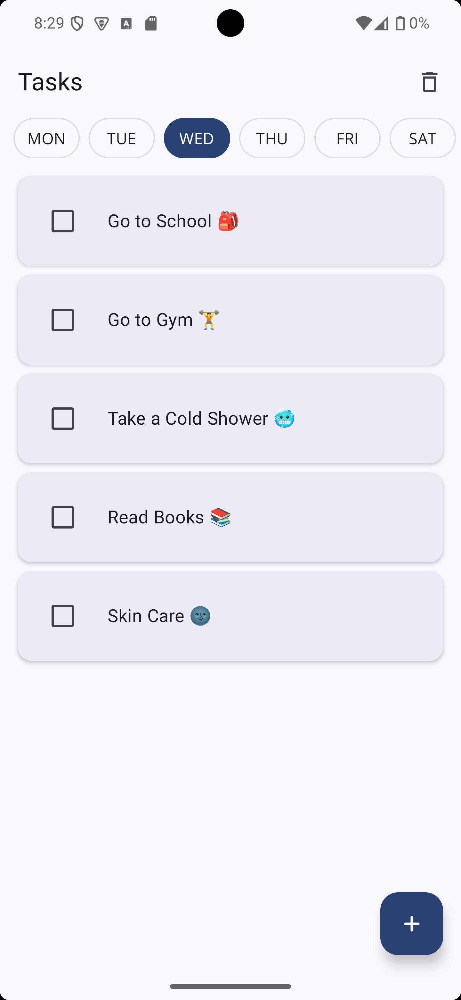
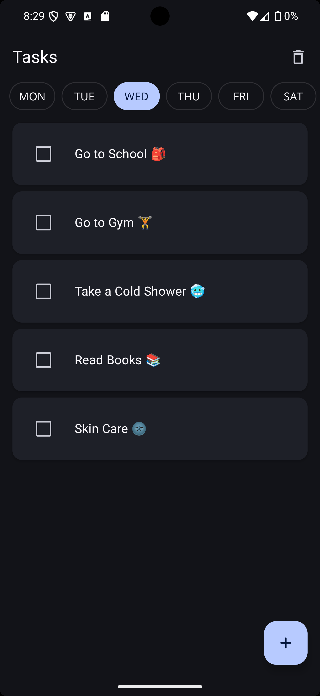

# 📝 FocusFlow - A Smart Todo App  
A modern **Jetpack Compose-based Todo App** following **Clean Architecture**, designed to help users efficiently manage their daily tasks.  

---

## 🎯 Features  
✅ **Task Management** - Add, delete, and mark tasks as done.  
✅ **Repeating Tasks** - Assign tasks to specific weekdays.  
✅ **Auto Day Selection** - The app automatically loads tasks for the current day.  
✅ **Day Navigation with Chips** - Users can switch between weekdays.  
✅ **Locked Future Tasks** - Tasks assigned to upcoming days are locked and cannot be modified.  
✅ **Lottie Animations** - Shows different animations when there are no tasks for the day.  
✅ **Dark & Light Theme Support** - UI adapts based on system theme.  

---

## 🛠 Tech Stack  
🔹 **Kotlin** - The primary language of the project.  
🔹 **Jetpack Compose** - Modern UI toolkit for Android.  
🔹 **Room Database** - Local database for storing tasks.  
🔹 **Flow & StateFlow** - Reactive state management.  
🔹 **Koin** - Dependency Injection framework.  
🔹 **Coroutines** - Efficient background task execution.  
🔹 **Material 3** - Beautiful UI components.  

---

## 📂 Project Structure  
This project follows **Clean Architecture** principles, separating concerns into layers:  

```
com.example.focusflow/
├── di/                      # Dependency Injection
├── data/                    # Data layer (Repository, Database)
│   ├── local/
│   │   ├── dao/             # Room DAOs
│   │   ├── entity/          # Database entities
│   │   └── database/        # Room database class
│   └── repository/          # Repository implementations
├── domain/                  # Business logic
│   ├── model/               # Domain models
│   ├── repository/          # Repository interfaces
│   └── usecase/             # Use Cases
├── presentation/            # UI Layer
│   ├── navigation/          # App Navigation
│   ├── theme/               # Dark & Light themes
│   ├── features/            # Screens & UI Components
│   │   ├── tasks/           # Task Management UI
│   │   ├── add/             # Add Task UI
└── utils/                   # Helper functions and utilities
```

---

## ⚙️ Installation & Setup  
To build and run the project locally:  

1️⃣ Clone the repository:  
```sh
git clone https://github.com/ShervinKazemi/FocusFlow.git
cd focusflow
```
2️⃣ Open the project in **Android Studio** (latest version recommended).  
3️⃣ Build and run on an emulator or physical device.  

---

## 📸 Screenshots  
| Light Mode | Dark Mode |
|------------|----------|
|  |  |

---

## 🚀 Future Enhancements  
🔹 **Push Notifications** - Reminders for pending tasks.  
🔹 **Task Filtering** - View only completed or pending tasks.  
🔹 **Custom Task Categories** - Group tasks by category.  
🔹 **Cloud Sync** - Save tasks to Firebase or another cloud service.  

---

## 🤝 Contribution  
Contributions are welcome! Feel free to submit issues or pull requests.  

💡 **Fork the repository → Make your changes → Create a Pull Request**  

---

## ⭐ Support the Project  
If you find this project useful, **consider giving it a ⭐ on GitHub!**  

📧 Contact: [shervink.codes@gmail.com](mailto:shervink.codes@gmail.com)
